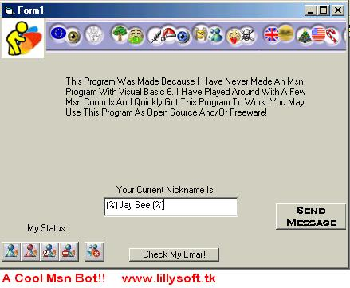



## A Cool Msn Messenger Bot\!\!

### Description

This Is A Cool Msn Bot! It Is Fully Functional Without Any Bugs. Tells You Your Nickname, User Info, Status Changer, And Is Easy To Understand The Coding. Please Enjoy This Code And Use Freely For Your Own Applications!! PLEASE VOTE FOR MY WORK!

**UPDATE**

An Update Is Now Released! It Is Called " Msn Toolbox ". It Is A Little More Advanced Than This, Though It Has HEAPS AND HEAPS Of Features. I Recommend Downloading This Before You Download Msn Toolbox. Thanking You, Jamie C.
 
### More Info
 

             |
---                |---
**Submitted On**   |2004-07-11 18:08:32
**By**             |[Jamie C](https://github.com/Planet-Source-Code/PSCIndex/blob/master/ByAuthor/jamie-c.md)
**Level**          |Beginner
**User Rating**    |4.8 (43 globes from 9 users)
**Compatibility**  |VB 6\.0
**Category**       |[Miscellaneous](https://github.com/Planet-Source-Code/PSCIndex/blob/master/ByCategory/miscellaneous__1-1.md)
**World**          |[Visual Basic](https://github.com/Planet-Source-Code/PSCIndex/blob/master/ByWorld/visual-basic.md)
**Archive File**   |[A\_Cool\_Msn1768297112004\.zip](https://github.com/Planet-Source-Code/jamie-c-a-cool-msn-messenger-bot__1-54869/archive/master.zip)

